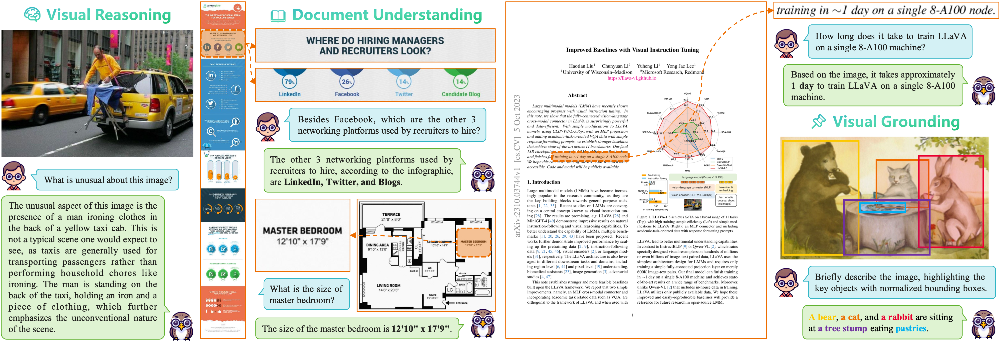

# TextHawk

[TextHawk2: A Large Vision-Language Model Excels in Bilingual OCR and Grounding with 16x Fewer Tokens]()

[TextHawk: Efficient Fine-Grained Perception of Multimodal Large Language Models]()

## Introduction

The **TextHawk** series represents a cutting-edge family of Large Vision-Language Models (LVLMs) designed for highly efficient fine-grained perception. Notably, TextHawk sets a milestone as the first LVLM to achieve a **16x** token compression ratio. This is made possible through the integration of four key components:

- **Scalable Positional Embeddings (SPEs)**
- **Query Proposal Network (QPN)**
- **ReSampling and ReArrangement (ReSA)**
- **Multi-Level Cross-Attention (MLCA)**

Building on the same architecture, **TextHawk2** enhances performance by leveraging greater data diversity and reinforcing the visual encoder. This iteration achieves state-of-the-art results across multiple benchmarks, excelling in tasks related to general multimodal understanding, Optical Character Recognition (OCR), and visual grounding. For instance, TextHawk2 delivers impressive metrics such as 78.4% accuracy on OCRBench, 81.4% accuracy on ChartQA, 89.6% ANLS on DocVQA, and 88.1% accuracy@0.5 on RefCOCOg-test.

TextHawk series can compress multiple times more words displayed on a small image, where each character measures under 8 pixels, into a few tokens, allowing for accurate recovery. It’s reminiscent of the futuristic gadgets in *Doraemon* anime.

## DocGemini

We create a new instruction-tuning dataset *DocGemini* for document-oriented tasks by enriching the multimodal document data with Gemini Pro. Each data sample contains:

- A brief summary of the document topics.
- Short QA pairs, up to 10.
- Insights behind each answer.
- [Optional] An imaginary conversations between two researchers.

DocGemini consists of 30K images and 195K QA pairs with insights.

| Dataset | QA | Conversation |
| :-: | :-: | :-: |
| DocVQA | [link](DocGemini/docvqa.jsonl) | [link](DocGemini/docvqa_conv.jsonl) |
| ChartQA | [link](DocGemini/chartqa.jsonl) | [link](DocGemini/chartqa_conv.jsonl) |
| InfoVQA | [link](DocGemini/infovqa.jsonl) | [link](DocGemini/infovqa_conv.jsonl) |

> Note: Alternatively, you can produce data on your own using the [scripts](DocGemini/generate.py) we provide.

## Benchmarks

TextHawk

| Model | ViT (Params.) | MME perception | MMB dev | SEED image | GQA | DocVQA | ChartQA | InfoVQA | TabFact | WTQ | RefCOCO val | RefCOCO test-A | RefCOCO test-B |
| :- | :-: | :-: | :-: | :-: | :-: | :-: | :-: | :-: | :-: | :-: | :-: | :-: | :-: |
$\text{Donut}$ | $\text{Swin-B}$ (0.1B) | - | - | - | - | 67.5 | 41.8 | 11.6 | 54.6 | 18.8 | - | - | -
$\text{Pix2Struct}$ | - | - | - | - | - | **76.6** | 58.6 | 40.0 | - | - | - | - | - |
$\text{InternLM-XC}$ | $\text{EVA-G}$ (1B) | **1528.4** | **74.8** | 66.1 | - | - | - | - | - | - | - | - | -
$\text{LLaVA-1.5-7B}$ | $\text{CLIP-L}$ (0.3B) | 1510.7| 65.2 | - | 62.0 | - | - | - | - | - | - | - | -
$\text{Shikra-7B}$ | $\text{CLIP-L}$ (0.3B) | - | 58.8 | - | - | - | - | - | - | - | 87.0 | <ins>91.1</ins> | 81.8
$\text{Qwen-VL-Chat}$ | $\text{CLIP-G}$ (2B) | 1487.6 | 60.6 | 65.4 | 57.5 | 62.6 | 66.3 | - | - | - | **88.6** | **92.3** | **84.5**
$\text{Monkey}$ | $\text{CLIP-G}$ (2B) | - | 59.3 | - | 60.7 | 66.5 | 65.1 | 36.1 | - | 25.3 | - | - | -
$\text{UReader}$ | $\text{CLIP-L}$ (0.3B) | - | - | - | - | 65.4 | 59.3 | 42.2 | 67.6 | 29.4 | - | - | -
$\text{TextMonkey}$ | $\text{CLIP-G}$ (2B) | - | - | - | - | 73.0 | **66.9** | - | - | 31.9 | - | - | -
$\textbf{TextHawk}^*$ | $\text{SigLIP-SO}$ (0.4B) | <ins>1520.9</ins> | 73.0 | **69.2** | **64.7** | <ins>73.6</ins> | 64.0 | <ins>47.3</ins> | <ins>70.7</ins> | <ins>33.5</ins> | <ins>87.3</ins> | 90.9 | <ins>83.3</ins>
$\textbf{TextHawk}$ | $\text{SigLIP-SO}$ (0.4B) | 1500.0 | <ins>74.6</ins> | **69.2** | <ins>64.6</ins> | **76.4** | <ins>66.6</ins> | **50.6** | **71.1** | **34.7** | 87.2 | 90.8 | 82.5

> Note: $\textbf{TextHawk}^*$ is fine-tuned without the DocGemini.

## Qualitative Results

